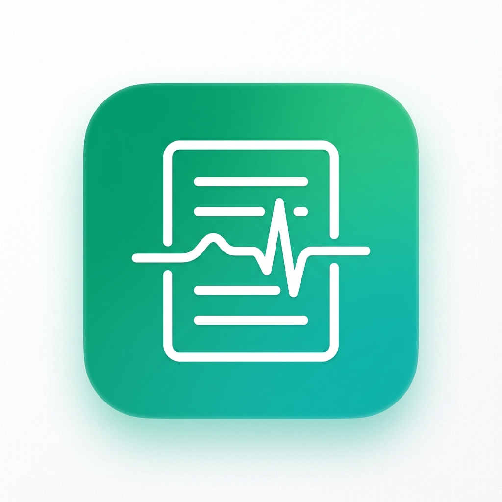
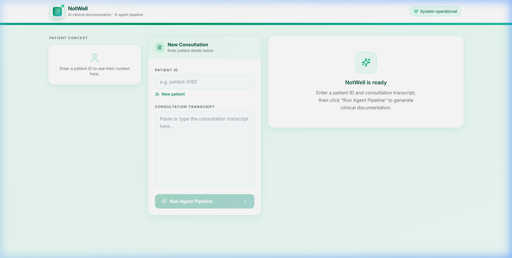
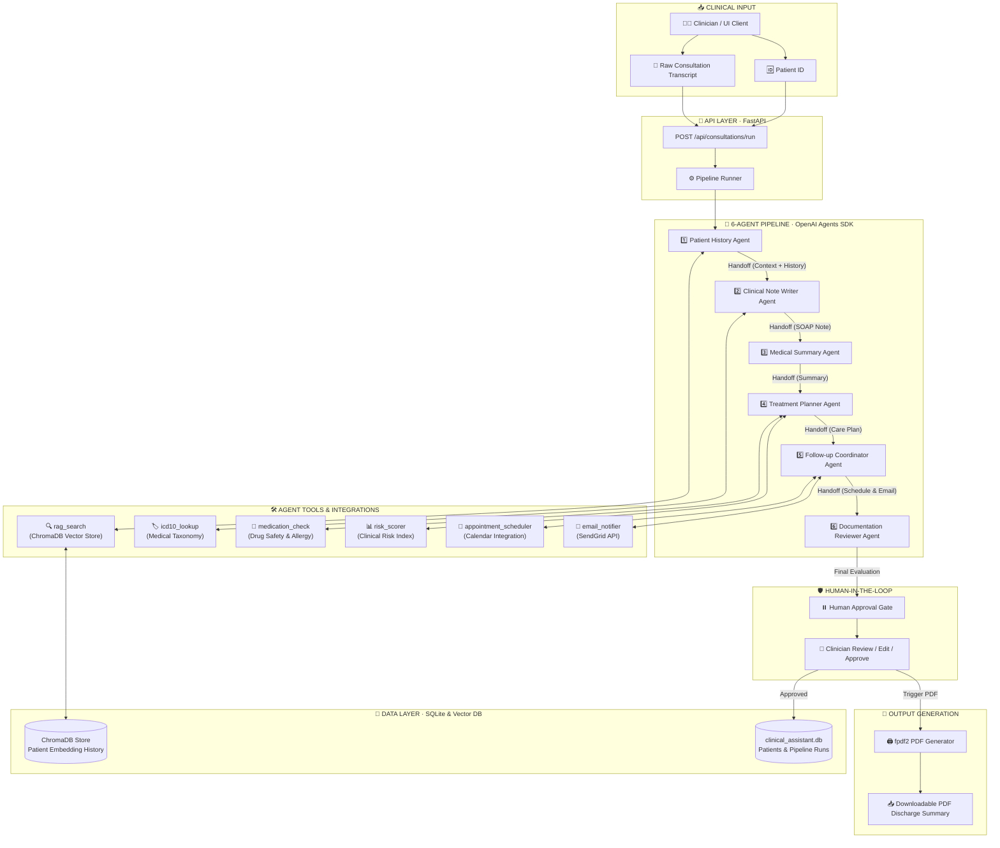

<h1 align="center">
  
  <span style="vertical-align: middle;">Notewell</span>
</h1>
<p align="center">
  <strong>AI Clinical Documentation Assistant</strong>
</p>

<p align="center">
  
</p>

<p align="center">
  <strong>Autonomous Multi-Agent Clinical Documentation & RAG Intelligence Pipeline</strong>
</p>

<p align="center">
  
  
  
  
  
  
  
  
  
</p>

<p align="center">
  <em>An autonomous multi-agent clinical documentation system built on the OpenAI Agents SDK. It ingests raw consultation transcripts, retrieves historical patient context via ChromaDB RAG, writes structured SOAP notes, constructs evidence-based treatment plans, schedules follow-ups, enforces human-in-the-loop review, and exports finalized PDF discharge summaries.</em>
</p>

---

## System Architecture

```
                                Consult Transcript & Patient ID
                                               │
                                               ▼
┌─────────────────────────────────────────────────────────────────────────────────────────────┐
│                                 NOTWELL 6-AGENT PIPELINE                                    │
│                                                                                             │
│  ┌─────────────────────────┐      ┌─────────────────────────┐      ┌─────────────────────┐  │
│  │ 1. Patient History      │─────▶│ 2. Clinical Note Writer │─────▶│ 3. Medical Summary │  │
│  │    Agent                │      │    Agent                │      │    Agent            │  │
│  └───────────┬─────────────┘      └───────────┬─────────────┘      └──────────┬──────────┘  │
│              │                                │                               │             │
│              ▼                                ▼                               │             │
│         [ChromaDB RAG]                  [ICD-10 Lookup]                       │             │
│                                                                               │             │
│  ┌─────────────────────────┐      ┌─────────────────────────┐                 │             │
│  │ 6. Documentation        │◀─────│ 5. Follow-up           │◀────────────────┘             │
│  │    Reviewer Agent       │      │    Coordinator Agent    │                               │
│  └───────────┬─────────────┘      └───────────┬─────────────┘                               │
│              │                                │                                             │
│              ▼                                ▼                                             │
│      [Compliance Check]            [Calendar & Email API]                                   │
└──────────────┼──────────────────────────────────────────────────────────────────────────────┘
               │
               ▼
   ┌───────────────────────┐
   │  Human Approval Gate  │ ────▶ Clinician Approval / Edit / Rejection
   └───────────┬───────────┘
               │
               ▼
   ┌───────────────────────┐
   │ PDF Discharge Summary │ ────▶ Downloadable fpdf2 Document
   └───────────────────────┘
```

---

## Pipeline Modules

| # | Agent / Module | Trigger | Primary Function | Key Tools & Operations |
|---|----------------|---------|------------------|------------------------|
| **01** | 📜 Patient History Agent | Pipeline Start | Context Retrieval | Queries ChromaDB vector store for prior consultation records (`rag_search`) and builds patient longitudinal baseline |
| **02** | ✍️ Clinical Note Writer | Agent 01 Handoff | SOAP Note Generation | Structures chief complaint, S/O/A/P clinical findings, and resolves diagnosis codes (`icd10_lookup`) |
| **03** | 📋 Medical Summary Agent | Agent 02 Handoff | Executive Synthesis | Distills complex clinical narrative into key medical insights, critical symptoms, and risk factors |
| **04** | 💊 Treatment Planner Agent | Agent 03 Handoff | Care Plan Formulation | Generates pharmacological/non-pharmacological recommendations, checks drug safety (`medication_check`), and stratifies risk (`risk_scorer`) |
| **05** | 📅 Follow-up Coordinator | Agent 04 Handoff | Care Continuity | Auto-schedules return appointments (`appointment_scheduler`) and dispatches patient email notifications (`email_notifier`) |
| **06** | 🔍 Documentation Reviewer | Agent 05 Handoff | Quality & Compliance | Audits generated documentation for completeness, safety warnings, and flags items requiring clinician attention |
| **07** | 🛡️ Human Approval Gate | User Action | Clinician Verification | Pauses workflow for clinician review, allowing sign-off, modifications, or rejection before generating the final PDF |

---

## Tech Stack

| Layer | Technology | Purpose |
|-------|-----------|---------|
| **Agent Framework** | OpenAI Agents SDK (`openai-agents`) | Multi-agent handoff orchestration, tool binding, and dynamic routing |
| **LLM Inference** | Groq (`llama-3.3-70b-versatile`) + OpenRouter | Primary fast inference engine with automatic multi-key rate-limit fallback |
| **Vector Database** | ChromaDB | Local vector store for semantic retrieval of past patient consultations (RAG) |
| **API Framework** | FastAPI + Uvicorn | Async REST API endpoints for pipeline execution, patient management, and PDF streaming |
| **Database** | SQLite + SQLAlchemy | Persistent storage for patients, consultation sessions, and approval records |
| **Frontend UI** | Next.js 14 (App Router) + Tailwind CSS | Responsive 3-column clinical dashboard with Framer Motion animations |
| **PDF Generation** | `fpdf2` | Programmatic PDF layout generation for clinical discharge summaries |
| **Tool Integrations** | SendGrid API, ICD-10 Search, Risk Scorer | Automated external scheduling, notification, and clinical verification tools |

---

## Data Flow

The following sequence details how data flows through Notewell, highlighting agent handoffs, tool executions, vector RAG retrieval, and human-in-the-loop review.



---

## Local Development

### Prerequisites

- **Python 3.11+**
- **Node.js 18+**
- API Keys: [Groq Console](https://console.groq.com/keys) · [OpenRouter](https://openrouter.ai/keys)

### 1. Repository Setup

```bash
git clone https://github.com/akshatbindal-075/Notwell
cd notewell
```

### 2. Backend Setup

```bash
cd backend
python -m venv venv

# Windows
.\venv\Scripts\activate
# macOS / Linux
source venv/bin/activate

pip install -r requirements.txt
cp .env.example .env
```

Configure your `.env` file:
```env
GROQ_API_KEY=gsk_your_primary_groq_key
OPENROUTER_API_KEY=sk-or-your_openrouter_key
ALLOWED_ORIGINS=http://localhost:3000
```

Start the backend service:
```bash
uvicorn app.main:app --reload --port 8000
# Backend API will be available at http://localhost:8000
```

### 3. Frontend Setup

In a new terminal:
```bash
cd frontend
npm install
cp .env.local.example .env.local
```

Configure `.env.local`:
```env
NEXT_PUBLIC_API_BASE_URL=http://localhost:8000/api
```

Start the web application:
```bash
npm run dev
# Frontend interface will be live at http://localhost:3000
```

---

## API Reference

| Method | Endpoint | Description |
|--------|----------|-------------|
| `POST` | `/api/consultations/run` | Triggers the full 6-agent clinical execution pipeline |
| `GET` | `/api/consultations/{session_id}` | Polls real-time pipeline status and agent output logs |
| `POST` | `/api/consultations/{session_id}/approve` | Submits clinician human approval or feedback decision |
| `GET` | `/api/consultations/{session_id}/pdf` | Downloads the generated PDF discharge summary |
| `POST` | `/api/patients` | Registers a new patient record in SQLite |
| `GET` | `/api/patients/{patient_id}` | Retrieves demographic and clinical context for a patient |
| `GET` | `/api/patients/{patient_id}/visits` | Fetches historical visit logs and RAG availability status |
| `GET` | `/health` | Health check verification endpoint |

---

## Project Structure

```
notewell/
├── backend/
│   ├── app/
│   │   ├── agents/              # 6 OpenAI Agents SDK agent definitions
│   │   ├── api/
│   │   │   └── routes.py        # FastAPI API routes & endpoints
│   │   ├── db/
│   │   │   ├── database.py      # SQLAlchemy engine & session setup
│   │   │   └── models.py        # Patient, PipelineRun, & Approval ORM models
│   │   ├── models/
│   │   │   └── schemas.py       # Pydantic validation schemas
│   │   ├── services/
│   │   │   ├── pipeline_runner.py   # Multi-agent orchestrator & execution service
│   │   │   ├── structuring.py       # Free-text to Pydantic extraction engine
│   │   │   ├── approval_manager.py  # Human approval state machine
│   │   │   └── model_providers.py   # Groq / OpenRouter / Gemini LLM providers
│   │   ├── tools/               # 7 custom clinical tool implementations
│   │   ├── config.py            # Environment configuration loader
│   │   └── main.py              # FastAPI app initialization, middleware, & CORS
│   ├── requirements.txt
│   ├── .env.example
│   └── Dockerfile
│
├── frontend/
│   ├── app/
│   │   ├── layout.js            # Root layout, Google Fonts, & metadata
│   │   ├── page.js              # Interactive 3-column clinical dashboard
│   │   └── globals.css          # Custom emerald/teal design system & styling
│   ├── components/
│   │   ├── AgentPipeline.js     # Live agent execution progress visualizer
│   │   ├── AgentOutputTabs.js   # Tabbed output inspector for all 6 agents
│   │   ├── PatientSidebar.js    # Patient history & RAG context sidebar
│   │   ├── ApprovalCard.js      # Interactive human approval card
│   │   ├── NewPatientForm.js    # Inline patient creation modal
│   │   └── Toast.js             # Notification banner component
│   ├── lib/
│   │   └── api.js               # Backend REST API client integration
│   ├── public/
│   │   ├── notewell-logo.png
│   │   └── screenshot.png
│   ├── tailwind.config.js
│   └── .env.local.example
│
├── .gitignore
└── README.md
```

---

## Environment Variables Reference

### Backend (`.env`)

| Variable | Required | Description |
|----------|----------|-------------|
| `GROQ_API_KEY` | ✅ | Primary Groq API key for Llama 3.3 70B inference |
| `GROQ_API_KEY_2` | Optional | Secondary Groq API key for automatic rate-limit fallback |
| `OPENROUTER_API_KEY` | ✅ | OpenRouter API key for fallback LLM routing |
| `GEMINI_API_KEY` | Optional | Google Gemini key for long-context operations |
| `DATABASE_URL` | Optional | Database connection URI (defaults to local SQLite) |
| `ALLOWED_ORIGINS` | ✅ | CORS allowed origins (e.g., `http://localhost:3000`) |
| `MODEL_FAST` | Optional | Override fast LLM model name |
| `SENDGRID_API_KEY` | Optional | SendGrid API key for patient follow-up emails |

### Frontend (`.env.local`)

| Variable | Required | Description |
|----------|----------|-------------|
| `NEXT_PUBLIC_API_BASE_URL` | ✅ | Base URL pointing to the FastAPI backend API |

---

## License

This project is licensed under the **MIT License**.
